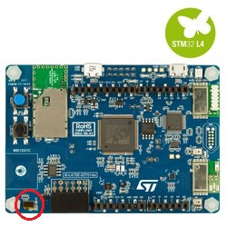

# Lab1 of ICT 710 course  
This is first lab of Software for embedded that consists of 3 problems. The board that we use is DISCO-L475VG-IOT01A:
- push-to-light-baremetal
- push-to-light-thread
- push-to-light-eventqueue

# Lab2 of ICT 710 course  
This is second lab of Software for embedded that consists of 3 problems. The board that we use is DISCO-L475VG-IOT01A:
- push-to-http access HTTP website (http://www.example.com)
- push-to-https access HTTPS website (https://www.example.com)
- push-to-mqtt publish to NETPIE2020

# Lab3 of ICT 710 course 
This is third lab of Software for embedded that consists of 3 problems. The board that we use is DISCO-L475VG-IOT01A:
- modify the flask-ws-register to work with Postgres database (http_main.cpp)
- study and make mbed code to read temperature and humidity, then send data to server
- make server code for /update and /query and deploy on Heroku cloud (app.py)

# Car-parking Group work assignment for Hardware part
This section is to explain the system in hardware part of Car-parking group

we use 
- 
- [VL53L0X](https://os.mbed.com/teams/ST/code/VL53L0X/#e9269ff624ed) library 

# Members
- Asadang Tanatipuk     6222040484  
- Pitisit Dillon        6222040278  
- Thanakorn Aksorndit   6222040336  
